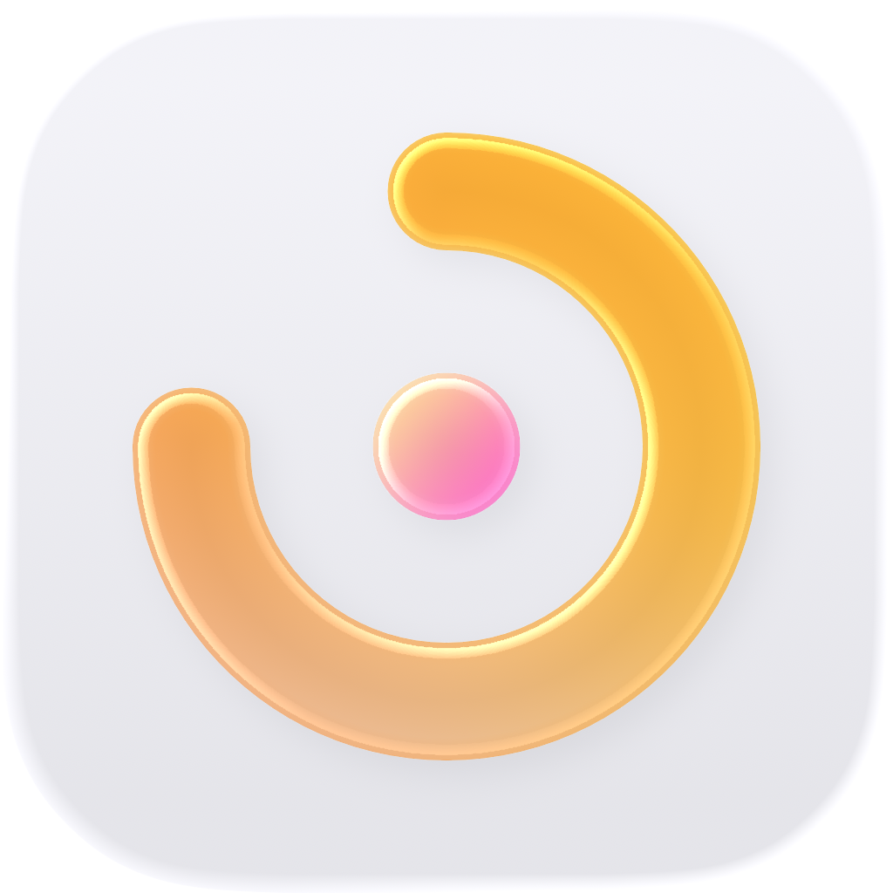

<p align="center">
  
</p>

<h1 align="center">Chrona</h1>

<p align="center">
  <a href="https://github.com/FoXLinne/ChronaApp/releases">
    
  </a>
  <a href="https://github.com/FoXLinne/ChronaApp/stargazers">
    
  </a>
  <a href="https://github.com/FoXLinne/ChronaApp/blob/main/LICENSE">
    
  </a>
</p>

<p align="center">
  一个简洁的 iOS 专注计时应用 · 原生 SwiftUI 构建
</p>

***

## 功能

### 计时模式

| 模式       | 说明                        |
| -------- | ------------------------- |
| **番茄钟**  | 预设 25/50 分钟工作 + 5/10 分钟休息 |
| **倒计时**  | 自定义时长（1 分钟 \~ 5 小时）       |
| **正向计时** | 无时间限制，记录专注时长              |

### 任务管理

- 创建、编辑、排序、搜索专注任务
- 为每个任务选择不同的计时模式和背景主题
- 自动将已完成任务置顶（可选）
- 已完成任务自动添加删除线（可选）
- 每日完成任务计数

### 专注统计

- 日/周/月筛选查看专注记录
- 任务分布饼图，了解时间分配
- 月度趋势图，追踪专注习惯
- 平均每日专注时长统计

### 实时活动与通知

- **灵动岛 & 锁屏显示** — 专注计时时在灵动岛和锁屏界面实时显示计时状态
- **每日提醒** — 定时推送专注提醒，完成当日专注后自动取消
- **沉浸模式** — 专注时自动进入极简黑屏显示，轻触即可唤醒控制

### 数据管理

- 自动 JSON 持久化存储
- 支持通过文件 App 导入/导出数据，方便备份与迁移
- 任务名称重复检测
- 一键清除所有数据

### 倒数日

- 追踪即将到来和已过去的重要事件
- 自动按日期排序，区分未来事件与过往事件

### 个性化

- 6 种背景主题（日落、森林、海洋、薰衣草、午夜、薄荷）
- 浅色/深色/跟随系统 三种主题模式
- 个人资料设置（头像、昵称、签名）
- 每日签到，记录连续专注天数

### 多语言

- 简体中文 · 繁體中文 · English · 日本語（部分使用 AI 翻译，结果可能不准确）

***

## 项目结构

```
Chrona/
├── Models/          # 数据模型（任务、记录、设置、倒数日）
├── ViewModels/      # 统一状态管理（AppViewModel）
├── Views/           # SwiftUI 界面（按功能模块分组）
│   ├── ActiveSession/  # 专注计时页
│   ├── Tasks/          # 任务列表与编辑器
│   ├── Statistics/     # 统计数据
│   ├── Countdown/      # 倒数日
│   ├── Profile/        # 个人与设置
│   └── Shared/         # 共享组件（背景、主题色、度量卡片）
├── Services/        # 业务逻辑（计时引擎、持久化、通知、屏幕控制）
├── Resources/       # 本地化字符串、图标等资源
└── Info.plist       # 应用配置
```

## 技术栈

- **语言**: Swift 6
- **UI 框架**: SwiftUI
- **最低部署**: iOS 26.0+

## 构建要求

- Xcode 26.0+
- iOS 26.0+
- Swift 6

### 构建步骤

1. 用 Xcode 打开 `Chrona.xcodeproj`
2. 选择 `Chrona` scheme
3. 选择目标设备（模拟器或真机）
4. 按 `Cmd + R` 构建并运行

> **注意**：灵动岛/实时活动功能需要真机（iPhone 14 Pro 或更新机型）或 iOS 26.0+ 模拟器才能完整测试。

## 设计原则

- 遵循 [Apple 人机交互指南](https://developer.apple.com/design/human-interface-guidelines/)
- 优先使用 SwiftUI 原生组件而非自定义实现
- 部分代码借助 AI 开发工具辅助构建

## 许可证

[GPL-3.0](LICENSE)

***

<p align="center">
  <a href="https://github.com/FoXLinne/ChronaApp">
    
  </a>
</p>
